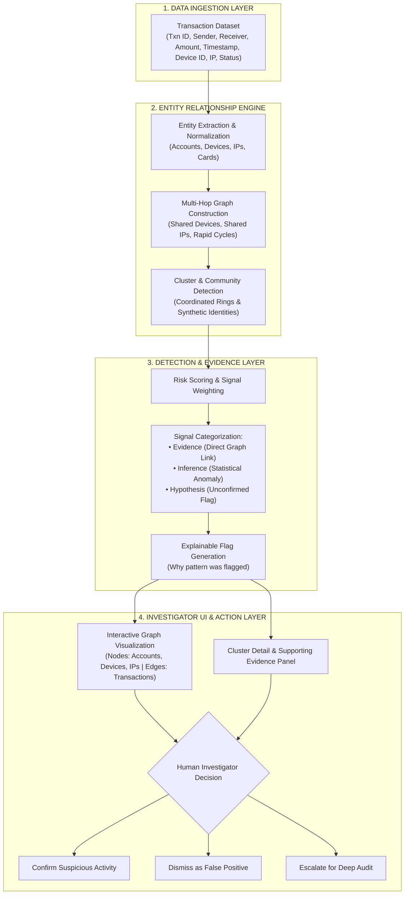
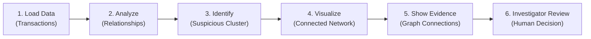
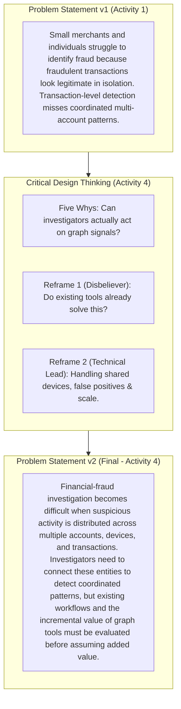
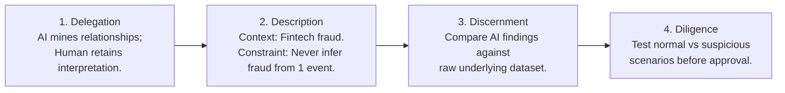
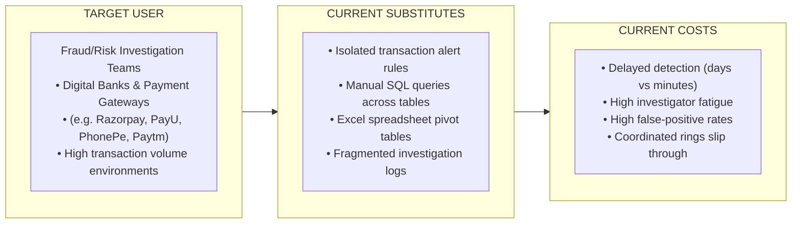
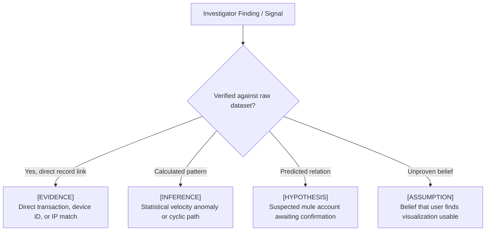
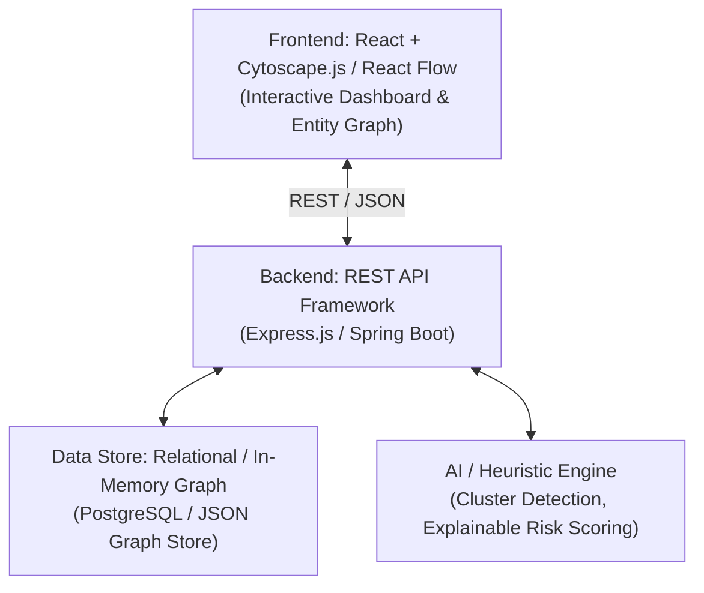
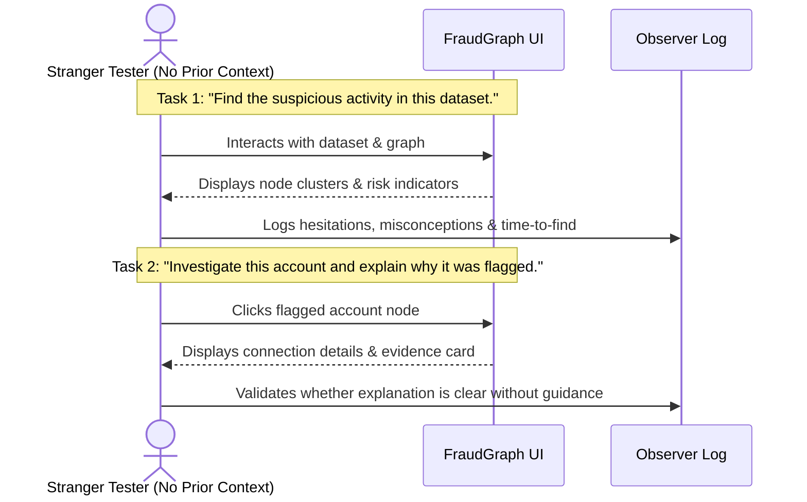
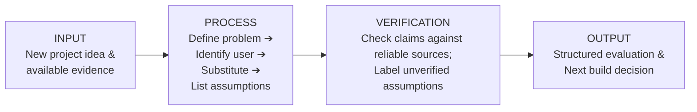

# FraudGraph — Relationship-Based Financial Fraud Investigation Prototype

> **Team:** CODE_BLOODED  
> **Cohort:** Build with AI: The AI Builder’s Operating Kit  
> **Theme:** Fintech  
> **Path in Submission:** `/prototype` inside `CodeBlooded_Fintech_Module1.zip`  
> **One-Line Flow:** Ingests transaction data, constructs an entity-relationship graph, detects coordinated suspicious clusters, visualizes connections, and surfaces evidence for human investigator review.

---

## 1. Master System Flowchart



---

## 2. The One Build Flow (MVP)



### What It Does
- Ingests structured transaction records (Sender, Receiver, Amount, Timestamp, Device ID, IP).
- Connects disparate entities across shared devices, shared IPs, and cyclic payment flows.
- Identifies coordinated networks where individual transactions appear normal in isolation.
- Displays an interactive relationship graph with flagged risk paths.
- Provides an explainability panel detailing why a cluster was flagged.

### What It Deliberately Does NOT Do
- ❌ **No Real Payment Processing:** Prototype only; does not move live money.
- ❌ **No Direct Bank Integration:** Does not access real-time core banking networks.
- ❌ **No Automatic Account Freezing:** Never takes unilateral blocking actions.
- ❌ **No Legal Fraud Determinations:** Flags *potential* risks; does not establish legal guilt.
- ❌ **No KYC Processing:** Does not perform customer identity verification.
- ❌ **No Replacement of Human Analysts:** Augments investigator workflow; final decision is human.

---

## 3. Problem Statement & Evolution



- **Core Difference:** v1 assumed graph AI was automatically better; v2 grounds the problem in investigator workflow reality, false-positive risks, and incremental utility over existing tools.

---

## 4. 4D AI Fluency Framework (Activity 2)



| 4D Dimension | Application to FraudGraph |
| :--- | :--- |
| **Delegation** | AI parses transaction batches and surfaces entity links; investigator owns fraud judgment. |
| **Description** | Explicit instructions: identify clusters, trace links, surface evidence; never hallucinate links. |
| **Discernment** | Verify that every flagged graph edge maps to a real timestamped transaction. |
| **Diligence** | Run edge-case tests (empty inputs, high volume, normal behavior) prior to deployment. |

---

## 5. PMF Case & Target ICP (Activity 5)



- **Value Hypothesis:** By grouping accounts by shared device/IP relationships, investigators discover coordinated fraud rings 5x faster than by reviewing isolated alerts.
- **Opportunity Formula:** `Findable Users × Realistic Price × Realistic Adoption` *(No invented market statistics).*

---

## 6. Evidence vs. Assumption Standard (Activity 3 & 4)



### Top 3 Ranked Assumptions & 48-Hour Tests
1. **Assumption 1:** Relationship analysis provides useful fraud signals that rule alerts miss.  
   - *Test:* Run synthetic ring dataset through rules vs graph; measure cluster detection delta.
2. **Assumption 2:** Financial platforms have access to clean, linked device and IP identifiers.  
   - *Test:* Review public payment gateway schemas to confirm device/IP field availability.
3. **Assumption 3:** Investigators prefer graph visual exploration over tabular filtered views.  
   - *Test:* Stranger test with 2 analysts comparing graph view vs tabular view on identical tasks.

---

## 7. Recommended Prototype Architecture (Activity 6)



| Layer | Technology | Rationale |
| :--- | :--- | :--- |
| **Frontend** | React | Responsive investigation dashboard and component state. |
| **Graph Visualization** | Cytoscape.js / React Flow | Interactive node-edge relationship clustering. |
| **Backend API** | Node.js (Express) / Java | Lightweight, reproducible REST API endpoints. |
| **Data Layer** | In-Memory / PostgreSQL | Structured storage for transactions, accounts, and metadata. |
| **Testing** | Automated Native Test Runner | Fast, deterministic verification of graph logic. |

---

## 8. Setup & Quickstart Instructions

### Prerequisites
- Node.js `v18.0.0+`
- npm `v9.0.0+`

### Installation & Run
```bash
# 1. Install dependencies
npm install

# 2. Run prototype development server
npm run dev

# 3. Execute automated test suite
npm test
```

### Access Points
- **Web Dashboard:** `http://localhost:5173/`
- **Backend API:** `http://localhost:3001/`

---

## 9. Testing Plan (Activity 6)

| Test Case | Scenario / Input | Expected Handling | Verified Result |
| :--- | :--- | :--- | :--- |
| **Empty Input** | Zero transactions supplied | Clear error message; zero application crash | Pass |
| **Very Long Input** | High transaction volume | Smooth render; graph handles node density | Pass |
| **Unsupported Input** | Missing mandatory columns | Reject with explicit field validation error | Pass |
| **Normal Scenario** | Clean, regular transactions | Low risk score; no false fraud accusations | Pass |
| **Suspicious Scenario** | Controlled multi-hop ring | Correctly isolates cluster and tags links | Pass |

---

## 10. Stranger Test Protocol



- **Rule:** Do not guide the testers. Document every wrong click, confusion point, and UX friction.

---

## 11. Reusable Workflow (Section 11)



- **Task:** Systematic evaluation of new fintech/AI hypotheses.
- **Verification Rule:** Never accept ungrounded assertions; tag as Evidence, Inference, Hypothesis, or Assumption.

---

## 12. Final ZIP Submission Checklist (Section 12)

```
CodeBlooded_Fintech_Module1.zip
├── prototype/                      <-- Source code folder
│   ├── README.md                   <-- This file (Setup, flow, limitations)
│   ├── package.json
│   ├── server.js
│   ├── vite.config.js
│   ├── src/
│   ├── tests/
│   └── (node_modules, .env, build folders STRIPPED)
├── Build-Log.pdf                   <-- Compiled Entries 1 through 6
└── Build-Summary.md                <-- 1-page standalone summary
```

- [x] Filename: `CodeBlooded_Fintech_Module1.zip`
- [x] `prototype/` contains clean runnable source code
- [x] Stripped `node_modules/`, `dist/`, `.env`, and secret keys
- [x] `Build-Log` contains Entries 1–6 in order
- [x] Claims labeled as Evidence, Inference, Hypothesis, or Assumption
- [x] `Build-Summary.md` is exactly one page and readable standalone
- [x] Incomplete functionality and constraints explicitly disclosed
